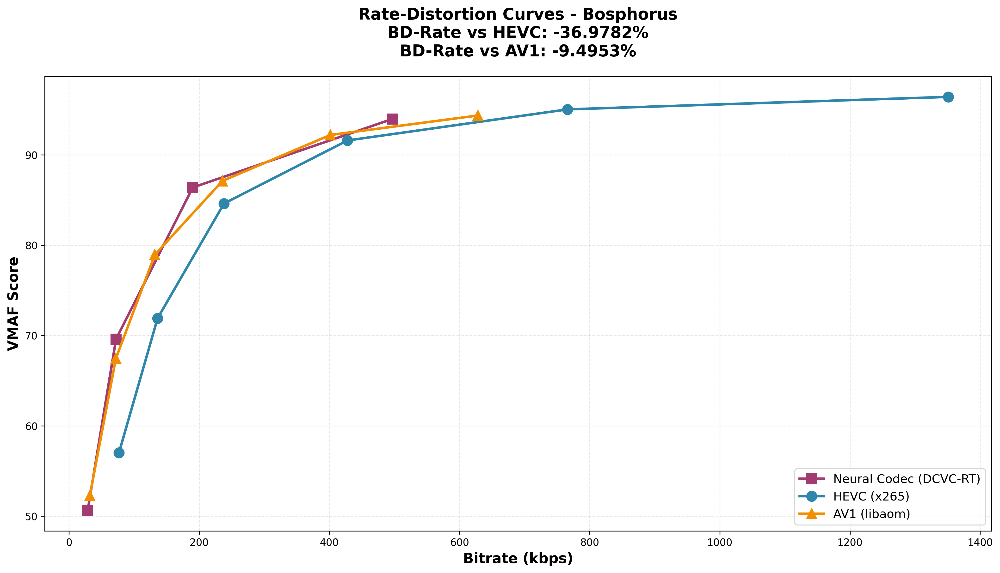
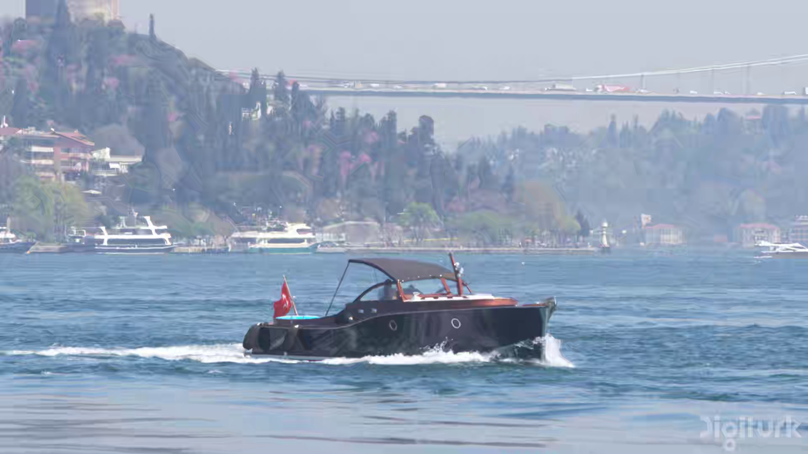
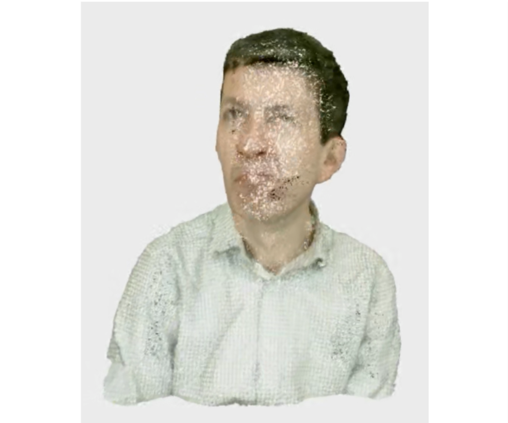
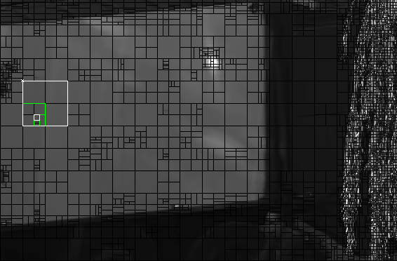

  <!-- 

    <h1>Tanvir Redoy</h1>
    
PhD Student in Computer Science at Baylor University

  
 -->
  

    <h2>About</h2>
    

      I am currently a Ph.D. Student in Computer Science at Baylor University, glad and greateful to be advised by <a href="https://acfreeman.dev">Dr. Andrew Freeman</a>. Prior to that, I obtained my B.Sc. degree in Computer Science and Engineering from Rajshahi University of Engineering and Technology (RUET), under the supervision of <a href="https://www.cse.ruet.ac.bd/kmzahir61">Md. Zahirul Islam</a>.
    

    

      My research interests include <strong>Video Streaming & Compression, Neural Video Coding, Computer Vision, Networking, Generative AI</strong>. I am passionate about developing novel approaches to solve complex problems in my field.
    

    

      Traveling, Photography, and Filmmaking—this combination makes feel me refreshed.
    

  

  

    <h2>🎯 News</h2>
    <ul>
      <li><strong>Dec, 2025</strong> — Preparing a research publication in collaboration with international researchers.</li>
      <li><strong>Nov, 2025</strong> — Reproduced a MoQ-based point-cloud live streaming system and extended it into a complete VV-DASH workflow.</li>
      <li><strong>Oct, 2025</strong> — Built out complete evaluation pipelines for neural codecs like DCVC-RT.</li>
      <li><strong>Sept, 2025</strong> — Analyzing emerging Neural Video Codecs (such as C3, NEVC-1.0, Cool-Chic).</li>
      <li><strong>Aug, 2025</strong> — Started Ph.D. in Computer Science at Baylor University.</li>
    </ul>
  

  

    
"My Boy, Life is Good, Life is Beautiful, Life is Simple."

    
Rezaul Karim, Dept. of Mathematics, Notre Dame College

  

  <!-- 

    <h2>Research Focus</h2>
    

      My research spans multiple areas within [field]. I focus on:
    

    <ul style="color: #555; line-height: 1.8;">
      <li><strong>Area 1:</strong> Brief description of your research in this area.</li>
      <li><strong>Area 2:</strong> Brief description of your research in this area.</li>
      <li><strong>Area 3:</strong> Brief description of your research in this area.</li>
    </ul>
  
 -->
  <!-- 

    

      <strong>📋 For more details:</strong> 
      Check out my <a href="#portfolio">portfolio</a>, 
      <a href="#publications">publications</a>, or 
      <a href="#cv">CV</a>.
    

  
 -->
  

    <h2>Research Projects</h2>
    <!-- Project 1 -->
    

      

        
        
      

      

        <h3 class="project-title">DCVC-RT vs HEVC/AV1 Efficiency Benchmarking</h3>
        

          <a href="https://github.com/tanvir-redoy/DCVC-RT-vs-HEVC-AV1-Efficiency-Benchmarking.git">Code</a>
        

        
Evaluation pipelines to compare traditional codecs with neural codecs, focusing on BD-rate, complexity, and real-time feasibility.

        <!-- <ul class="project-points">
          <li>.</li>
        </ul> -->
      

    
    
    <!-- Project 2 -->
    

      

        
        
      

      

        <h3 class="project-title">Point Cloud Live Streaming—MoQ vs DASH</h3>
        

          <a href="https://arxiv.org/abs/2507.15673">Paper (arXiv)</a>
        

        
Latency driven MoQ-based point cloud live streaming pipeline, and performance comparison against VV-DASH architecture.

        <!-- <ul class="project-points">
          <li>.</li>
        </ul> -->
      

    

    <!-- Project 3 -->
    

      

        
        
      

      

        <h3 class="project-title">Cuboidal Image Map utilization to generate CUs partition decisions</h3>
        

          <a href="https://ieeexplore.ieee.org/abstract/document/10869620">Paper</a> / <a href="https://github.com/tanvir-redoy/CUBOIDAL-image-map-procesisng-to-generate-CUs-partition-decisions">Code</a>
        

        
Modification of VVC encoder (VTM-20.2) pipeline to bypass expensive RDO stages and integrate algorithm-generated predictions.

        <!-- <ul class="project-points">
          <li></li>
        </ul> -->
      

    

    <!-- Project 4 -->
    <!-- 

      

        
        
      

      

        <h3 class="project-title">Project Title 4</h3>
        

          <a href="#">Project Page</a> / <a href="#">Paper</a> / <a href="#">Code</a>
        

        
Brief description of the project and its significance.

        <ul class="project-points">
          <li>Key feature or finding of the project</li>
          <li>Technical approach or methodology used</li>
          <li>Impact or results achieved</li>
        </ul>
      

    
 -->
  

  

    <h2>📝 Selected Publications</h2>
    <!-- 
Highlights from my recent publications. Full list available below.
 -->
    <ul>
      <li><strong>[ACM NOSSDAV 2026, (Under Review)]</strong> A. C. Freeman, M. Rudolph, <strong>T. A. Redoy</strong>, F. Schnier, H. Hassler, S. Afzal, A. Rizk. <a href="https://arxiv.org/abs/2507.15673">Point Cloud Streaming with Latency-Driven Implicit Adaptation using MoQ</a></li>
      <li><strong>[IEEE DICTA 2024]</strong> M. Z. Islam, <strong>T. A. Redoy</strong>, A. Ahmmed, M. Paul, M. Murshed. <a href="https://ieeexplore.ieee.org/abstract/document/10869620">Leveraging the Cuboidal Partitioning for Low Complexity CTU Structure Prediction in Versatile Video Coding</a></li>
    </ul>
    
<a href="https://scholar.google.com/citations?hl=en&user=_nnDhe4AAAAJ">View full publications →</a>

  

  <!-- 

    <h2>Talks</h2>
    
Selected talks and presentations.

    
<a href="/talks/">View talks →</a>

  
 -->
  

    <h2>Teaching</h2>
    
Lecturer | Dept. of CSE, Daffodil International University, Dhaka, Bangladesh
      <ul>
        <li>Jan, 2025 - April, 2025: Compiler Design (CSE331, CSE332), Artificial Intelligence Lab (CSE412), Theory of Computation (CSE228).</li>
        <li>May, 2025 - July, 2025: Object Oriented Programming with Java (CSE221, CSE222).</li>
      </ul>
    

    
<a href="https://sites.google.com/view/tanvirahmedredoy/teaching">View teaching videos →</a>

  

  <!-- 

    <h2>Portfolio</h2>
    
Selected projects and case studies.

    
<a href="/portfolio/">View portfolio →</a>

  
 -->
  

    <h2>🏆 Awards & Honors</h2>
    <ul>
      <li>Prime Minister Cub-Scout Award [1st position nationwide], Bangladesh Scouts.</li>
      <li>1st in 8th semester, GPA: 4.00, Dept. of CSE, RUET.</li>
      <li>100% Attendance Certificate, Notre Dame College, Dhaka.</li>
      <li>Education Board scholarships e.g., HSC, SSC.</li>
    </ul>
    
<a href="https://sites.google.com/view/tanvirahmedredoy/awards">View photos →</a>

  

  <!-- 

    <h2>Blog Posts</h2>
    
Notes and articles.

    
<a href="/year-archive/">View blog →</a>

  
 -->
  <!-- 

    <h2>CV</h2>
    
Download my CV for a detailed overview.

    
<a href="/cv/">View CV →</a>

  
 -->

